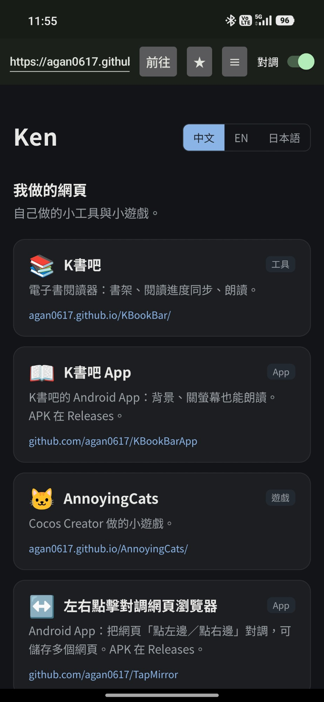

# TapMirror（左右點擊對調網頁瀏覽器）

Android 的 WebView 小瀏覽器，把**點畫面左邊／右邊**這兩個操作對調。



給那種「點右邊翻下一頁、點左邊翻上一頁」的網頁用——習慣反過來的人，開這支 App 看就好。

## 功能

- 上面一條網址列＋「對調」開關；開關開著時，點右邊＝原本的點左邊、點左邊＝原本的點右邊
- **只對「點一下」對調**：拖曳、上下捲動、雙指縮放、長按都照原樣，不會捲反或選錯字
- **儲存多個網頁**（1.1）：按 ★ 把目前這頁存起來（名稱預設是網頁標題，可改），按 ≡ 列出已存的網頁點一下切換，長按可刪除
- 最後看的網址與開關狀態會記住，下次打開照舊
- 在 Chrome 對網址按「分享」，或用「用其他應用程式開啟」選這支，會直接開那一頁
- 返回鍵是網頁的上一頁

## 原理

不是改網頁，是在 `MirrorWebView` 攔截觸控事件：判定為「點一下」（放開前沒移動超過系統的 touch slop、沒超過長按時間、只有一根手指）時，把整串事件的 X 座標鏡射成「寬度 − X」再交給網頁。網頁不管是用 `click`、`touchstart` 還是 pointer 事件判斷左右，看到的都是對調後的位置。

判定要等到手指放開才知道，所以按下時先暫存不送；一旦移動超過 slop、多了第二根手指、或按超過長按時間，就把暫存的原始事件照原樣補送，之後直接放行。副作用是長按會比平常慢一點才觸發。

## 安裝

到 [Releases](../../releases) 下載最新的 `.apk`，在手機上打開安裝（第一次要允許瀏覽器或檔案管理員安裝不明應用程式）。

## 程式結構

| 檔案 | 內容 |
|---|---|
| `MainActivity.java` | 網址列、對調開關、已存網頁（★ 儲存／≡ 切換與刪除）、WebView 設定、接收分享來的網址 |
| `MirrorWebView.java` | 觸控事件的暫存、判定與鏡射 |

設定存在 SharedPreferences（`tapmirror`）：`url`、`mirror`、`bookmarks`（JSON 陣列 `[{title,url}, …]`）。

## 建置

需要 Android Studio 內建的 JDK（`C:\Program Files\Android\Android Studio\jbr`）與 SDK 34。

```
set JAVA_HOME=C:\Program Files\Android\Android Studio\jbr
gradlew assembleRelease
```

產出 `app/build/outputs/apk/release/app-release.apk`（用這台電腦的 debug 金鑰簽章，換電腦建置的版本要先移除舊的才能裝）。

改版時改 `app/build.gradle` 的 `versionCode`（+1）與 `versionName`；發 Release 的 tag 用 `v` + versionName（例如 `v1.1`）。

⚠️ 從 Claude 桌面版開的 shell 建置時，`%TEMP%` 會被 MSIX 沙盒導走，Gradle 會報「Unable to establish loopback connection」。把 `TEMP`／`TMP` 設到 `D:\Temp\jdk`，並加 `JAVA_TOOL_OPTIONS=-Djdk.net.unixdomain.tmpdir=D:\Temp\jdk -Djava.io.tmpdir=D:\Temp\jdk`。
